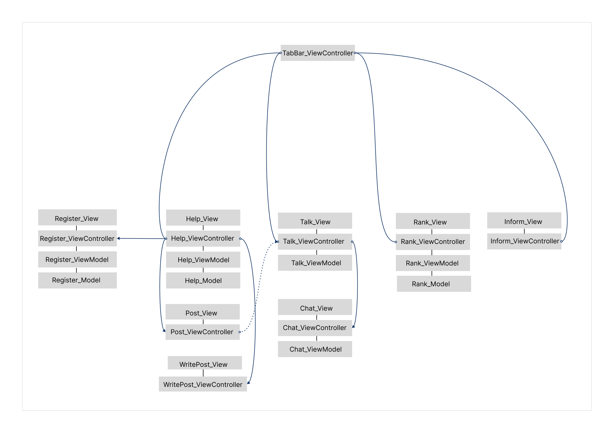

<h1>어플리케이션 인복</h1>
<h3>&#8226; 하나의 서비스를 온전히 혼자서 만들어 보는 프로젝트</h3>
<h3>&#8226; 고민상담 어플리케이션</h3>
<body> 
    <h3>전체구성</h3>
    
    <ul>
        <li>고민 포스트</li>
        <li>고민 작성</li>
        <li>대화방 목록</li>
        <li>1:1 채팅</li>
        <li>유저 랭킹</li>
        <li>유저 정보</li>
    </ul>
    

    <h3>사용기술과 이유</h3>
    <ul>
        <li><b>MVVM</b> : 이전 프로젝트에서 ViewController의 비중이 너무 커져서 다른 방법을 찾다 선택함</li>
        <li><b>Code-base UI</b> : 스토리보드는 협업이 불편하다고 생각하여 선호되지 않았음</li>
        <li><b>UIKit</b> : SwiftUI의 정보보다 UIKit의 정보가 많아 배우기에 UIKit이 유리해보였음</li>
        <li><b>snapKit</b> : AutoLayout 코드의 가독성을 위해서</li>
        <li><b>realmDB</b> : 대화 내용을 저장하기 위한 DB</li>
        <li><b>Alamofire</b> : 서버와 통신할때의 코드 가독성을 위해서</li>
        <li><b>rabbitMQ</b> : 유저간 채팅을 주고받기 위해 기능을 구상한 것을 똑같이 제공 해주길래 사용</li>
    </ul>
    <ul>
        <li><b>aws EC2 & RDS</b> : 24시간 서비스를 제공하는 서버를 위해서 아마존 서버를 대여함(집 인터넷이 불안정)</li>
        <li><b>Flask</b> : 백엔드보다 프론트 엔드에 힘을 쏟고싶어서 만들기 쉬워보이는 Flask 선택</li>
    </ul>
    <ul>
        <li><b>Figma</b> : 사전 디자인이 없으면 개발하면서 디자인을 해야해서 흐름이 계속해서 막힌다 생각하여, 사전디자인을 진행했고.
        협업에 Figma가 많이 쓰인다하여 미리 사용해보자는 마음에 선택
        </li>
    </ul>
    

    <h3>코드 구성</h3>
    
    <h5>서버와의 통신 횟수를 줄이기 위해 help_VC에서 가져온 유저 정보와 게시글 정보를 VC간에 계속 전달해주었음.</h5>
    <h3>채팅 시스템</h3>
    <ul>
        <li>RabbitMQ를 사용하여 메세지를 주고 받는 기능을 구현</li>
        <li>Talk ViewController에서 메세지를 받으면 RealmDB에 저장</li>
        <li>Chat ViewController에서 RealmDB Notification으로 Observing 하여 데이터의 변화를 알아챈다.</li>
        <li>Chat View의 테이블뷰에 추가된 데이터 row를 추가한다.</li>
    </ul>
    
</body>
